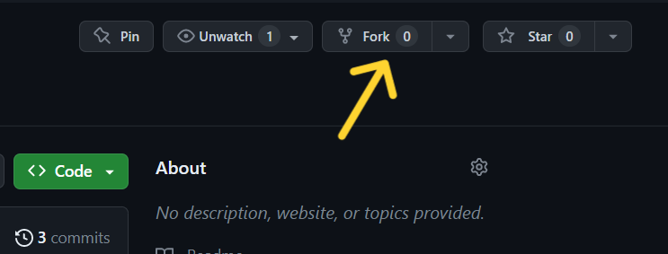
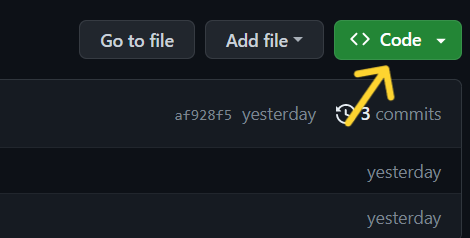
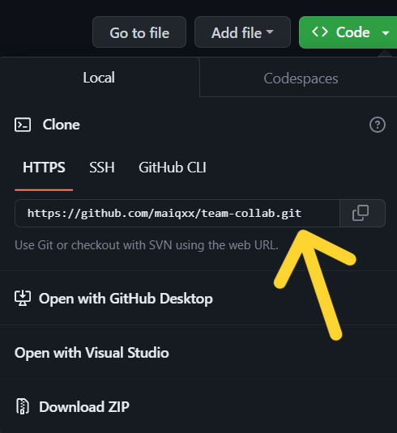
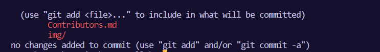
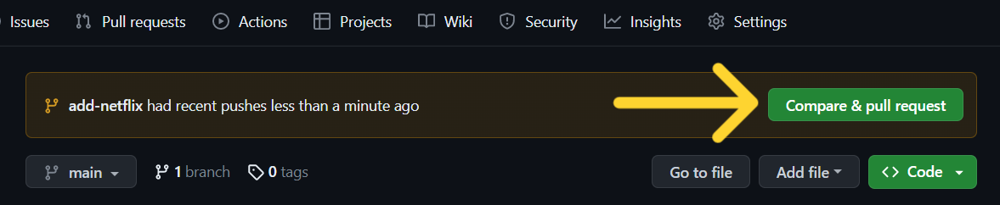
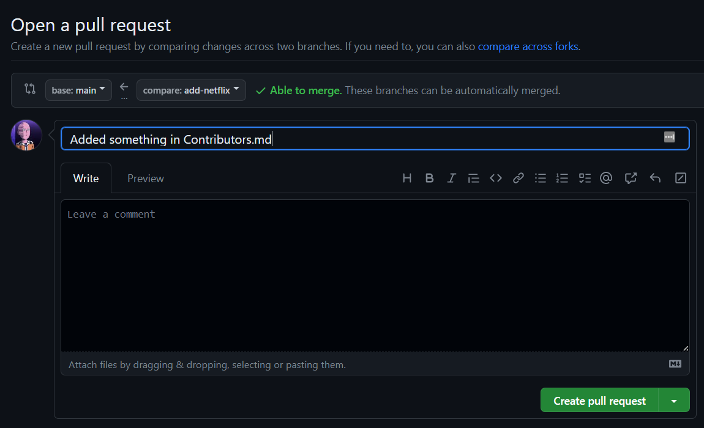

#### Google Developer Student Clubs Cebu Technological University

# Git & GitHub Workshop
The goal of this project is to make it easier for newbies to collaborate with others. Just follow the steps below:


<!-- [If you're not comfortable with the command line, [here are tutorials using GUI tools.](#tutorials-using-other-tools)](url) -->


#### If you don't have git on your machine, [install it](https://docs.github.com/en/get-started/quickstart/set-up-git).

------------------------------------------------------



## Step 1: Fork this repository

Make a copy of this repository in your account by clicking on the "fork" button at the top of this page.

## Step 2: Clone the repository



Next, copy the forked repository to your computer. Open your GitHub account and navigate to the forked repository. Then, click on the "code" button and select the _copy to clipboard_ icon.

Open a terminal and run the following git command:

```
git clone "url you just copied"
```

wher the "url you just copied" (without the quotation marks) refers to the web address of your forked repository, which you obtained in the previous steps.



For example:

```
git clone https://github.com/your-username/team-collab.git
```

where `your-username` is your GitHub username. In this step, you are transferring the files and information from the team-collab repository on GitHub to your own computer.

## Step 3: Create a branch

Navigate to the repository directory on your computer (if you haven't done so already):

```
cd team-collab
```

Now create a branch using the `git switch` command:

```
git switch -c give-your-branch-a-name
```

For example:

```
git switch -c add-forda-go
```

## Step 4: Make necessary changes and commit those changes

Using a text editor, open the file named `Contributors.md`. Add your name to the file, making sure not to add it at the very beginning or end of the file. You can place it anywhere in between. Once you've added your name, save the file.



If you go to the project directory and execute the command `git status`, you'll see there are changes.

Add those changes to the branch you just created using the `git add` command:

```
git add Contributors.md
```
Now commit those changes using the `git commit` command:

```
git commit -m "Add your-name to Contributors list"
```

replacing `your-name` with your name.

## Step 5: Push changes to GitHub

Push your changes using the command `git push`:

```
git push -u origin your-branch-name
```

replacing `your-branch-name` with the name of the branch you created earlier.

For example:

```
git push -u origin add-forda-go
```

<!-- <details>
<summary> <strong>If you get any errors while pushing, click here:</strong> </summary>

- ### Authentication Error
     <pre>remote: Support for password authentication was removed on August 13, 2021. Please use a personal access token instead.
  remote: Please see https://github.blog/2020-12-15-token-authentication-requirements-for-git-operations/ for more information.
  fatal: Authentication failed for 'https://github.com/<your-username>/first-contributions.git/'</pre>
  Go to [GitHub's tutorial](https://docs.github.com/en/authentication/connecting-to-github-with-ssh/adding-a-new-ssh-key-to-your-github-account) on generating and configuring an SSH key to your account.

</details> -->

## Step 6: Submit your changes for review

If you go to your repository on GitHub, you'll see a `Compare & pull request` button. Click on that button.



Now submit the pull request.



I will soon merge all of the changes you made into the main branch of this project. Once the changes have been merged, you will receive a notification. 


## What a NICE!

Congratulations! You have successfully completed the typical process of forking, cloning, editing, and submitting a pull request that is commonly used by contributors.

Join our club and let's grow together! [Join GDSC CTU](https://gdsc.community.dev/cebu-technological-university/).

